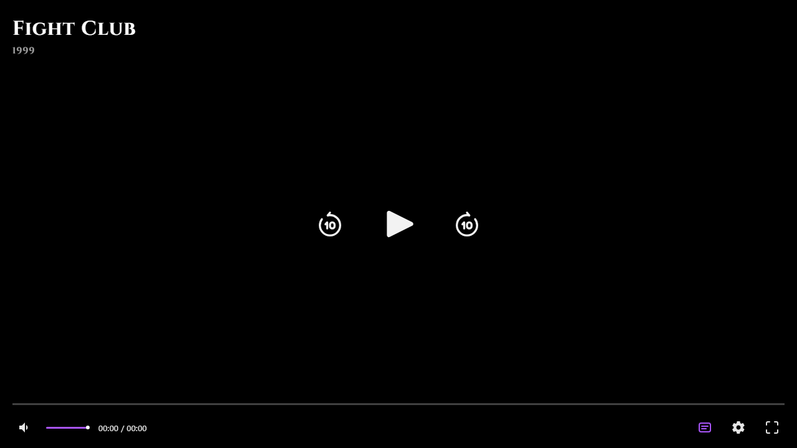

<div align="center">
  <br />
  <a href="#-about">
    
  </a>
  <br />

  # 🛸 Ollyflix Autonomous AI Live Ad Tracker
  **Advanced Stream Sniffer & Real-Time Dashboard**
  
  <p align="center">
    <a href="https://nodejs.org/"></a>
    <a href="https://pptr.dev/"></a>
    <a href="https://github.com/rameshkumarsahutmr-web/ads-tracker/blob/master/LICENSE"></a>
    <a href="https://github.com/rameshkumarsahutmr-web/ads-tracker/stargazers"></a>
  </p>
  
  *A next-generation intelligence tool designed to bypass bots, strip invasive ads, and sniff streams with AI precision.*

  <br />
</div>

---

## ⚡ Why Ollyflix Ad Tracker?

Traditional ad blockers rely on static lists. **Ollyflix** uses *Runtime JS Monkey-Patching* and *Puppeteer-Stealth* to actively dismantle clickjackers, bypass Cloudflare/Turnstile, and dynamically extract secure streams in real-time. It’s not just an ad blocker; it’s an autonomous stream extraction engine.

---

## 💎 Premium Features

<table>
  <tr>
    <td width="50%">
      <h3>🛡️ Stealth Anti-Bot Evasion</h3>
      <p>Seamlessly bypasses Cloudflare, Turnstile, and advanced bot protections using Puppeteer-Stealth.</p>
    </td>
    <td width="50%">
      <h3>🐒 Runtime JS Monkey-Patching</h3>
      <p>Intercepts <code>window.open</code>, <code>fetch()</code>, and XHR requests on the fly to kill popunders instantly.</p>
    </td>
  </tr>
  <tr>
    <td width="50%">
      <h3>📡 Live HLS Dashboard</h3>
      <p>Features a built-in Real-Time Web GUI (SSE Event Streaming) on port 3300 to monitor activities visually.</p>
    </td>
    <td width="50%">
      <h3>🕵️‍♂️ Stream Headers Sniffer</h3>
      <p>Generates ready-to-use configurations for ExoPlayer (Kotlin/Java), VLC, and FFmpeg automatically.</p>
    </td>
  </tr>
</table>

<details>
<summary><b>👉 Click here to see more features (Categorized Ad Intelligence & Next.js SPAs)</b></summary>
<br>

- **Categorized Intelligence**: Pinpoints and categorizes ads (Betting, Adult, Popunder, VAST, Telemetry).
- **Smart Overlay Buster**: Auto-detects transparent overlays and simulates real user play events.
- **SPA Extractor**: Effortlessly handles modern Next.js/React Single Page Applications (like ZXC-Prime).
</details>

---

## 🚀 Getting Started

### 1. Prerequisites
Make sure your system is ready:
- **Node.js** (v16.x or newer)
- **Git**

### 2. Quick Installation
```bash
# Clone the repository
git clone https://github.com/rameshkumarsahutmr-web/ads-tracker.git

# Enter the directory
cd ads-tracker

# Install required dependencies
npm install
```

---

## 💻 Usage & Dashboard

You can run Ollyflix in Dual Mode (Command Line OR Web GUI). 

**Option A: One-Click Start (Windows)**
Simply double-click the `RUN_TRACKER.bat` file to start the engine.

**Option B: Terminal Start**
```bash
node live_tracker.js
```

### 🎛️ Access the Web Dashboard
Once the tracker boots up, open your browser and navigate to the live monitoring dashboard:
> 🔗 **[http://localhost:3300](http://localhost:3300)**

---

## 📁 System Architecture

| File/Folder | Purpose |
|-------------|---------|
| `live_tracker.js` | The core Node.js application and Puppeteer engine |
| `RUN_TRACKER.bat` | Quick launch script for Windows users |
| `ad_blocklist_cache.txt` | Auto-generated intelligent cache of blocked domains |
| `LATEST_SCAN_REPORT.txt` | Detailed human-readable breakdown of the last scan |
| `LATEST_SCAN_DATA.json` | Raw structured data for API integrations |

---

<div align="center">
  <p>
    
  </p>
  <i>Built with passion and ❤️ by <b>Ramesh CSC Center</b></i>
</div>
